 
Dysarthria Checker
=
 
A diagnose app for detect dysarthria with ML and Korean vocalization for Korean 

## Features 
#### Home 
> Check your latest inspection results at a glance. 

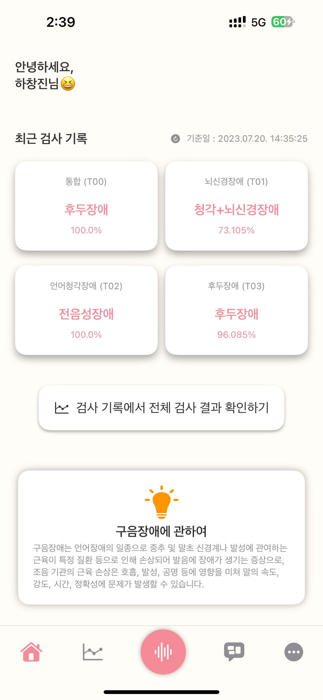 

#### Trends 
> Check your dysarthria trends with graph  

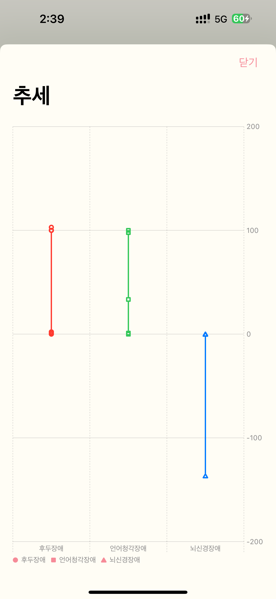 

#### Statistics 
> Check your inspection results history by date. 

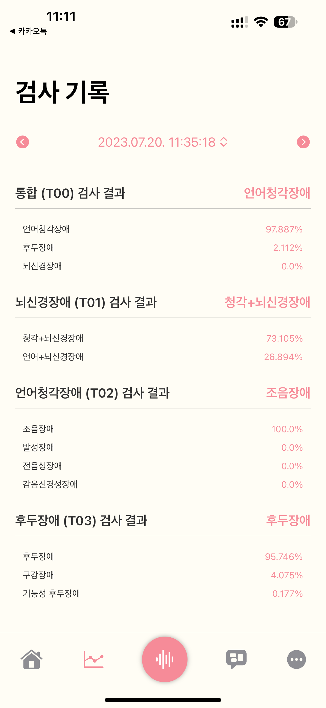 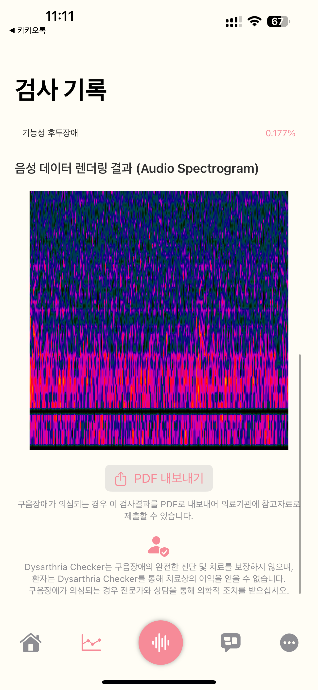 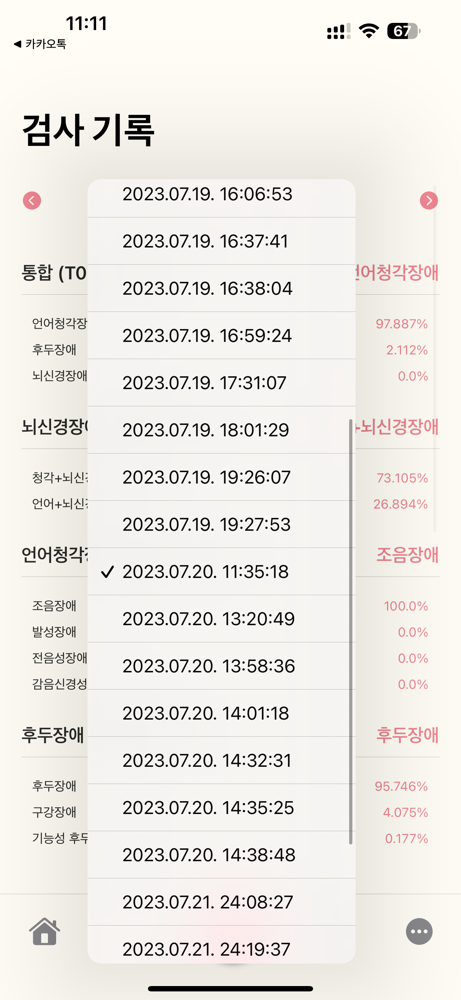 

> Export Inspection results as PDF 

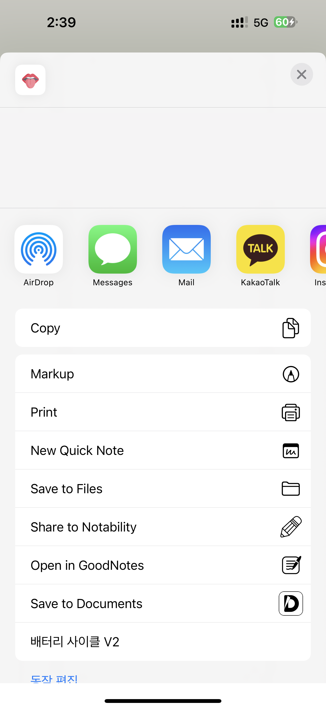 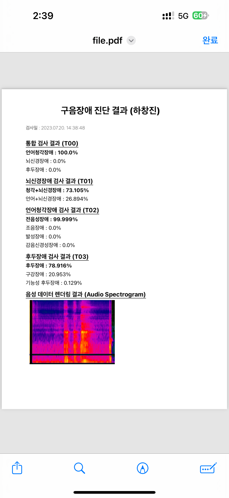 

#### Inspection 
> Inspect your dysarthria with speeching by word, sentence, paragraph, semi-free speech and free speech powered by ML 

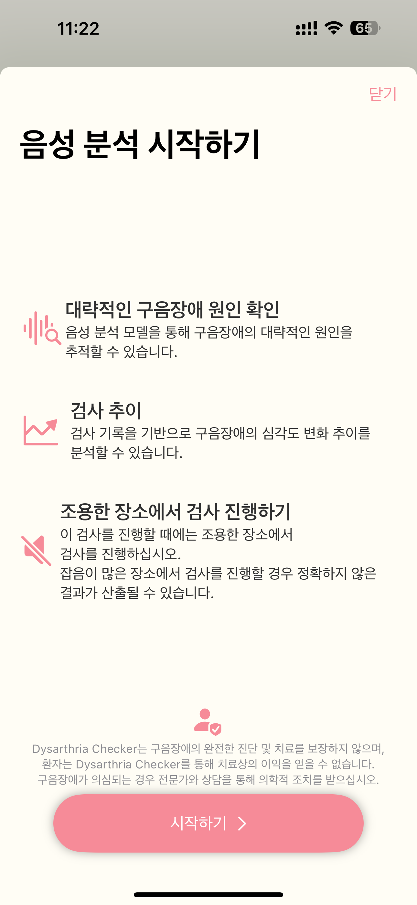 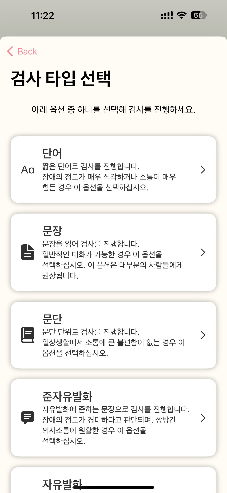  

> Get your inspection results powered by 95% or up accuracy ML Model, it's fast, accurate 

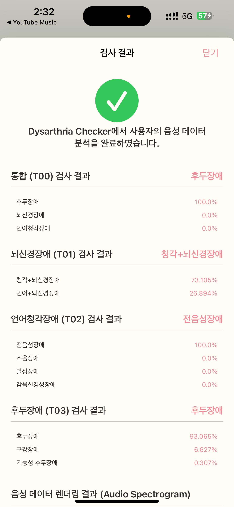 

#### Train 
> Train your dysarthria with AR 

 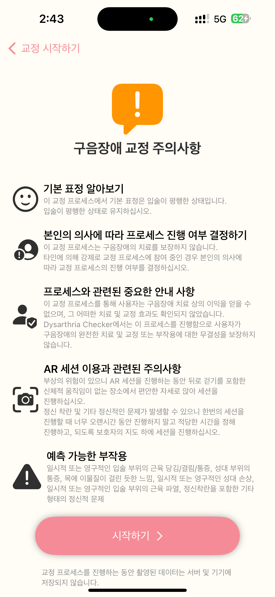 

#### and so much more. 
> Change your information, delete your data on server, change your disease info, sign out, and secession  

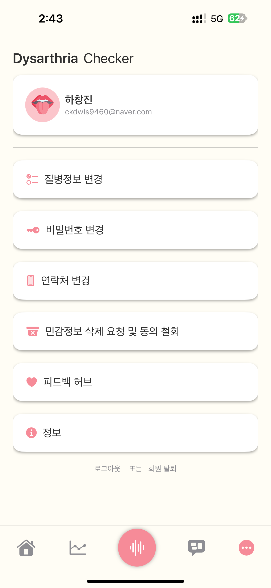  

## Compatibility 
> Dysarthria Checker is compatible with these devices.  
### iPhone 

> iPhone 14 Pro Max  
 iPhone 14 Pro  
 iPhone 14 Plus  
 iPhone 14  
 iPhone 13 Pro Max  
 iPhone 13 Pro  
 iPhone 13  
 iPhone 13 mini  
 iPhone 12 Pro Max  
 iPhone 12 Pro  
 iPhone 12  
 iPhone 12 mini  
 iPhone SE (3rd-Generation) (AR Train not supported.)  

### iPad 

> iPad Pro 12.9 6th-Generation  
 iPad Pro 11 4th-Generation  
 iPad Pro 12.9 5th-Generation  
 iPad 11 3rd-Generation  
 iPad Pro 12.9 4th-Generation  
 iPad 11 2nd-Generation  
 iPad Pro 12.9 3rd-Generation  
 iPad Pro 11 1st-Generation  
 iPad Air (5th-Generation) (AR Train not supported.)  
 iPad Air (4th-Generation) (AR Train not supported.)  
 iPad mini (6th-Generation) (AR Train not supported.)  
 iPad (10th-Generation) (AR Train not supported.)  

 * Required iOS/iPadOS 16 or up.
