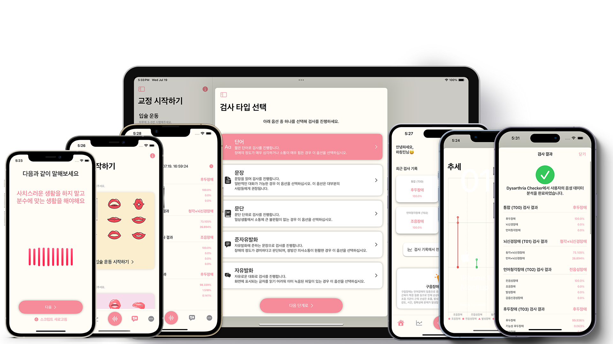 
Dysarthria Checker
=
 
A diagnose app for detect dysarthria with ML and Korean vocalization for Korean 

[Changjin Ha, Taesik Go. "Development of a Mobile Application for Disease Prediction Using Speech Data of Korean Patients with Dysarthria" Journal of Biomedical Engineering Research 45.1 (2024): 1-9](https://www.kci.go.kr/kciportal/ci/sereArticleSearch/ciSereArtiView.kci?sereArticleSearchBean.artiId=ART003057725)  

## 🚀 Tech Stack

### Client (iOS)

</a>
</a>
</a>

### Audio Engineering (iOS)

- AVFoundation: Record user speech as 44.1kHz PCM WAV
- RosaKit: Extract Mel Spectrogram from raw audio signal
- Metal: Hardware-accelerated GPU pipeline for rendering spectrograms

### Backend (BaaS & Serverless)

- Firebase Firestore: Save and sync patient's diagnostic results

### AI

- PyTorch Mobile: Execute lightweight `.ptl` models directly on iOS
- Hierarchical Classification: Sequential inference pipeline (T00 to T03) for deep dysarthria analysis

## 🏗️ Architecture

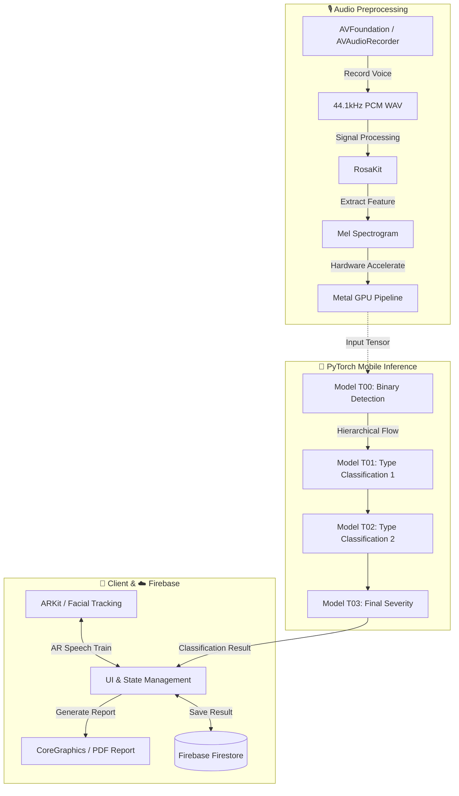
```mermaid
graph TD
    %% Audio Processing Pipeline
    subgraph AudioPipeline [🎙️ Audio Preprocessing]
        Mic[AVFoundation / AVAudioRecorder]
        WAV[44.1kHz PCM WAV]
        Rosa[RosaKit]
        Mel[Mel Spectrogram]
        Metal[Metal GPU Pipeline]

        Mic -->|Record Voice| WAV
        WAV -->|Signal Processing| Rosa
        Rosa -->|Extract Feature| Mel
        Mel -->|Hardware Accelerate| Metal
    end

    %% AI Inference Pipeline (Hierarchical)
    subgraph AIPipeline [🧠 PyTorch Mobile Inference]
        T00[Model T00: Binary Detection]
        T01[Model T01: Type Classification 1]
        T02[Model T02: Type Classification 2]
        T03[Model T03: Final Severity]

        Metal -.->|Input Tensor| T00
        T00 -->|Hierarchical Flow| T01
        T01 --> T02
        T02 --> T03
    end

    %% Client & Backend
    subgraph ClientBackend [📱 Client & ☁️ Firebase]
        UI[UI & State Management]
        AR[ARKit / Facial Tracking]
        PDF[CoreGraphics / PDF Report]
        Firestore[(Firebase Firestore)]

        AR <-->|AR Speech Train| UI
        T03 -->|Classification Result| UI
        UI -->|Generate Report| PDF
        UI <-->|Save Result| Firestore
    end
```

## 🧱 If I were to rebuild it in 2026

| Layer | Original | 2026 Pick | Reason |
|---|---|---|---|
| Audio recording | AVAudioRecorder + manual WAV header | AVAudioRecorder (native WAV, no manual header) | Fewer silent bugs |
| Spectrogram | RosaKit | vDSP + Accelerate (already imported) | No CocoaPods dep, same performance |
| GPU rendering | Metal + custom shaders | Metal (keep) | Already well-done |
| ML inference | PyTorch Mobile Nightly | CoreML `.mlpackage` + Neural Engine | 2-5x faster, non CocoaPods, stable API |
| Crypto | CryptoSwift@main | Apple CryptoKit | Hardware-accelerated, no dep |
| Credentials | UserDefaults | Keychain via KeychainAccess (SPM) | Security baseline |
| Build system | CocoaPods + SPM hybrid | SPM only | After CoreML migration |
| Concurrency | Completion handlers + @MainActor blocking | Swift Concurrency + background actors | Prevents UI freeze |
| State machine | `switch progress` multi-call | Single `async throws` inference function | Safe, testable API |

## ✨ Core Features 

Show Contents

#### Home 
> Check your latest inspection results at a glance. 

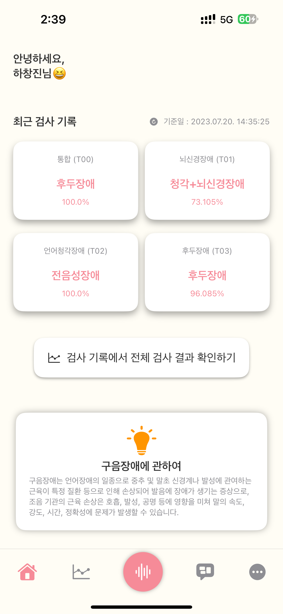 

#### Trends 
> Check your dysarthria trends with graph  

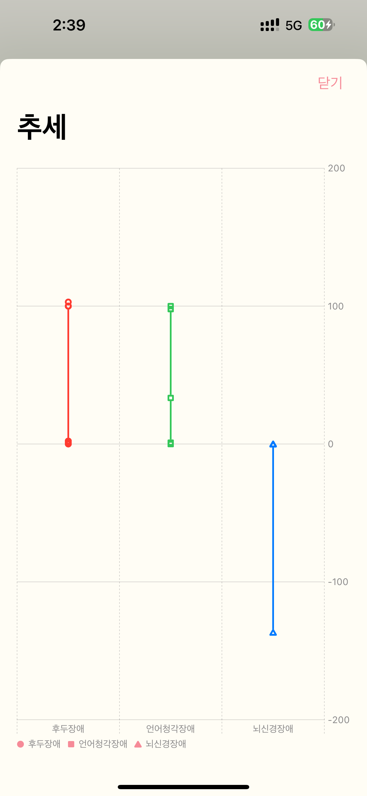 

#### Statistics 
> Check your inspection results history by date. 

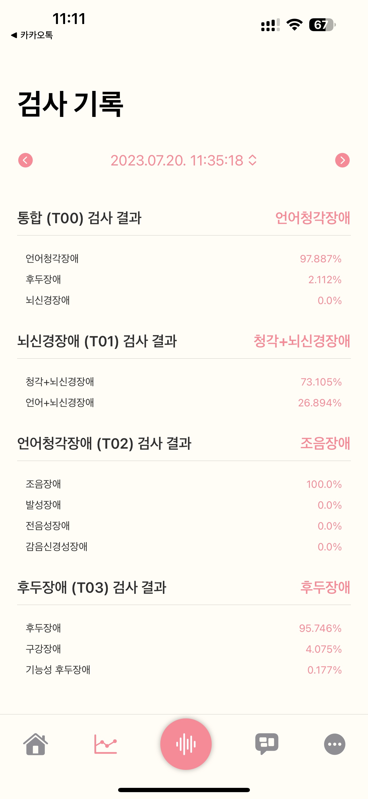 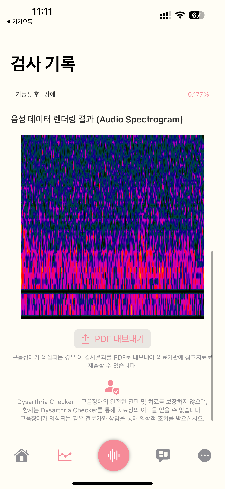 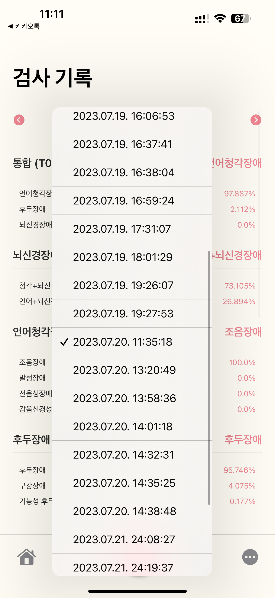 

> Export Inspection results as PDF 

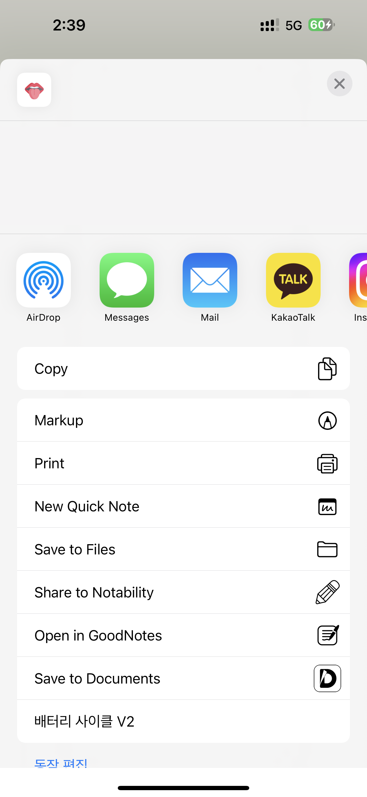 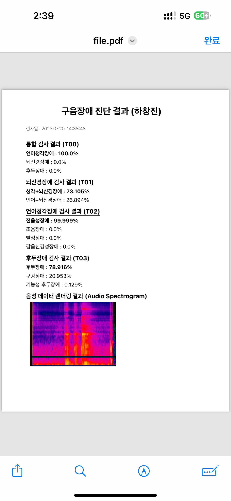 

#### Inspection 
> Inspect your dysarthria with speeching by word, sentence, paragraph, semi-free speech and free speech powered by ML 

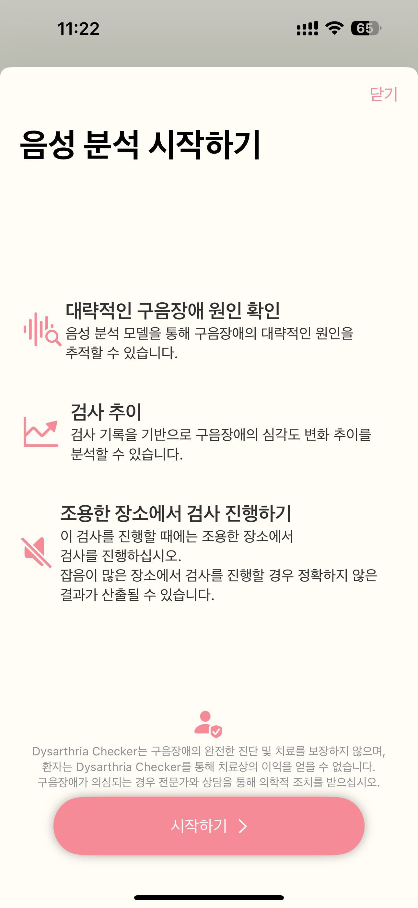 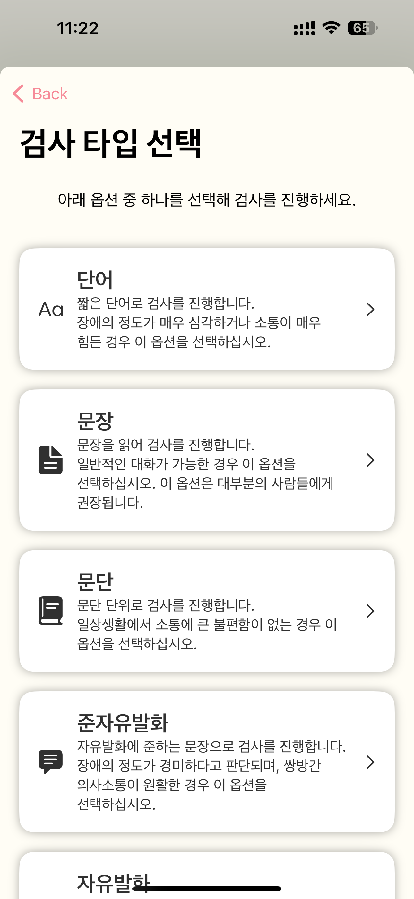  

> Get your inspection results powered by 95% or up accuracy ML Model, it's fast, accurate 

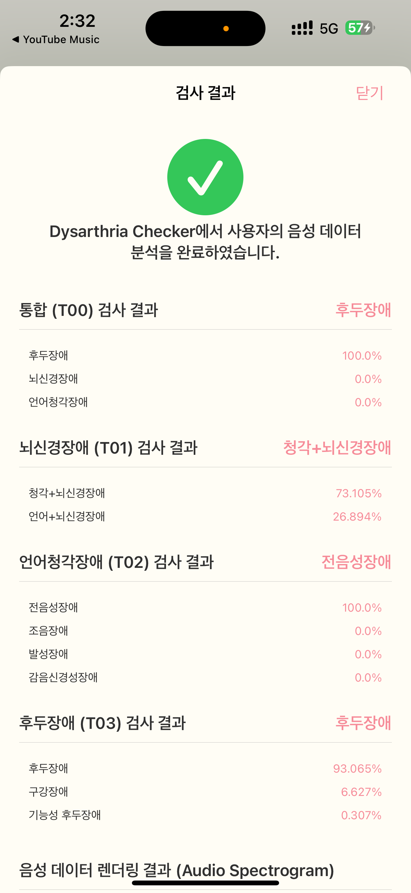 

#### Train 
> Train your dysarthria with AR 

 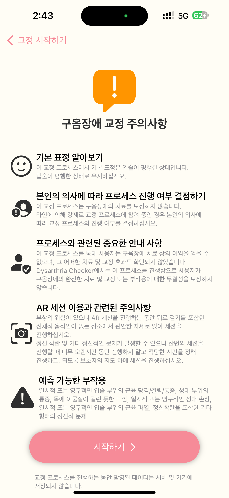 

#### and so much more. 
> Change your information, delete your data on server, change your disease info, sign out, and secession  

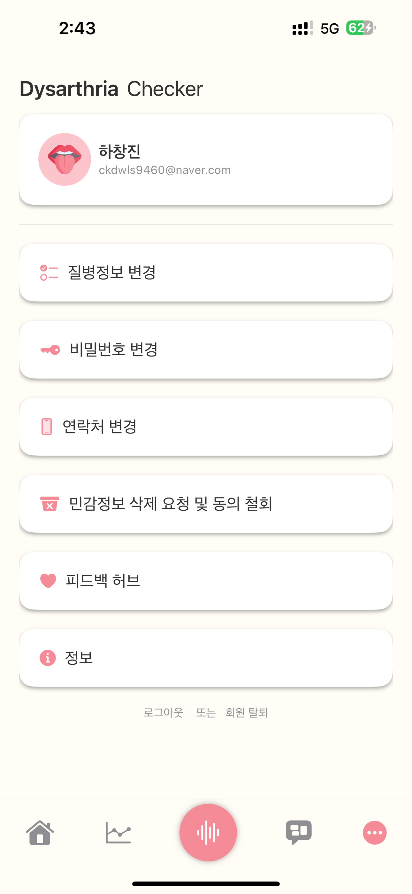  

## Compatibility 
> Dysarthria Checker is compatible with these devices.  
### iPhone 

> iPhone 14 Pro Max  
 iPhone 14 Pro  
 iPhone 14 Plus  
 iPhone 14  
 iPhone 13 Pro Max  
 iPhone 13 Pro  
 iPhone 13  
 iPhone 13 mini  
 iPhone 12 Pro Max  
 iPhone 12 Pro  
 iPhone 12  
 iPhone 12 mini  
 iPhone 11 Pro Max  
 iPhone 11 Pro  
 iPhone 11  
 iPhone Xs Max  
 iPhone Xs  
 iPhone XR  
 iPhone SE (3rd-Generation) (AR Train not supported.)  
 iPhone SE (2nd-Generation) (AR Train not supported.)  

### iPad 

> iPad Pro 12.9 (6th-Generation)  
 iPad Pro 11 (4th-Generation)  
 iPad Pro 12.9 (5th-Generation)  
 iPad Pro 11 (3rd-Generation)  
 iPad Pro 12.9 (4th-Generation)  
 iPad Pro 11 (2nd-Generation)  
 iPad Pro 12.9 (3rd-Generation)  
 iPad Pro 11 (1st-Generation)  
 iPad Pro 12.9 (2nd-Generation) (AR Train not supported.)  
 iPad Pro 10.5 (AR Train not supported.)  
 iPad Air (5th-Generation) (AR Train not supported.)  
 iPad Air (4th-Generation) (AR Train not supported.)  
 iPad Air (3rd-Generation) (AR Train not supported.)  
 iPad mini (6th-Generation) (AR Train not supported.)  
 iPad mini (5th-Generation) (AR Train not supported.)  
 iPad (10th-Generation) (AR Train not supported.)  
 iPad (9th-Generation) (AR Train not supported.)  

 * Required iOS/iPadOS 16 or up.

